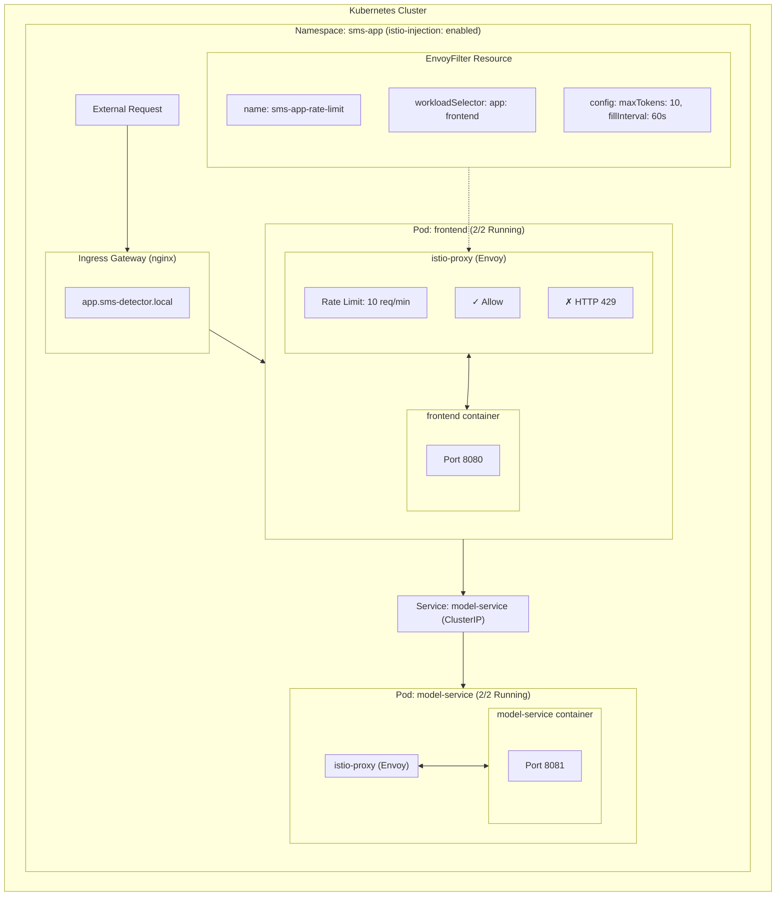

## Week 1

### Team:

No work on the repository.

## Week 2 A1

### Radu

For F9, we added an automated workflow that trains the SMS classifier and publishes the model artifacts as versioned GitHub Releases. For F10, the model-service was updated to load its model externally, downloading it at startup if missing and caching it in a mounted directory.
Links: https://github.com/doda25-team23/model-service/pull/1, https://github.com/doda25-team23/model-service/pull/3

### Ocean

F7 & F8:
Created Docker compose setup in operation repository. The .yml file orchestrates the frontend (9090) and model-service (8081) microservices, pulling from GH container registry. README.m provides a guide for starting including links to all repos. GH actions workflow is implemented for automated releases, App workflow triggers automatically on pushes to main and extracts versions from pom.xml metadata. The modelservice workflow triggers on Git tags. Both publish versioned and :latest images to GH container registry.

--Made the mistake to work directly on main, the commits:
Operations:
7a8a6bccb1a542fb1949921de8db633e852b3712, 3dfcf23bda2237a3ae9e35dacf3fa2b85a075608
App:
878e39172c555919bc2941d71915620aa7420a39
cfa73a015e397bec9a3b031944601849e95d06e0
Model-service:
484051246dc9e7cb103f8835c8628609df74da10
35a0fe5b8024c74333ac3a547ba96519b31fb81f

### Cristian

F3–F6 & small F10 adjustments:

Implemented full containerization and release engineering for both the app and model-service microservices. Added a multi-stage Dockerfile for the app and a flexible, volume-based Dockerfile for the model-service, supporting dynamic ports and external model loading. Set up GitHub Actions workflows in both repositories to automatically build and publish multi-architecture images (amd64/arm64) to the GitHub Container Registry, using tag-based version extraction for model-service and metadata-based versioning for the app. Made both services expose configurable ports and read required configuration through environment variables, making them fully composable and production-ready.

App commits: 6f35491, a12f979, 1294c61
Model-service commits: 2f712b8
Operation commits: 355f920

### Brewen

Delivered F1–F2 by creating the reusable `lib-version` Maven module with a `VersionUtil` class that reads packaged meta-data, exposing the version to the `app` service and wiring in a GitHub Actions workflow that builds/tests the library, tags releases, and publishes to GitHub Packages. Also owned F10–F11: updated `model-service` to fetch its model at startup via a mounted volume instead of bundling it, and extended the release automation so stable releases bump from the current `*-SNAPSHOT` while every branch build produces a timestamped pre-release artifact.

---

## Week 3 A2

### Radu

Implemented the general.yaml playbook to prepare all cluster nodes with the required base configuration (SSH access, swap disable, kernel modules, sysctl settings, Kubernetes packages, and fully configured containerd). The playbook was tested on node-1 and ran successfully end-to-end using ansible_local via Vagrant. This ensures all machines are ready for the controller/worker setup steps.
Link: https://github.com/doda25-team23/operation/pull/3

### Ocean

VM insfrastructure setup, Vagrantfile that provisions 1 control node and 2 worker nodes running Ubuntu 24.04. Setup includes NAT and host-only networking, has local ansible provisioners for cross-platform, a shared folder for kubeconfig export, and placeholder Ansible playbooks for Radu to work in. Added my SSH key to folder.

--Made the mistake to work directly on main, the commits:
802a102c62a07a8be3d3859ccb6abe34670a4e5b
88eb0033b642c3bd320f3b9bb2b04b5ad23dffd4
3abc237a82f0ed1364b80e528f26a1eceae032c3

### Cristian

Implemented the Kubernetes cluster setup playbooks (ctrl.yaml and node.yaml) to turn provisioned VMs into a fully functional cluster. ctrl.yaml initializes the control plane with kubeadm, exports to both the vagrant user and shared folder for host access, installs Flannel CNI with --iface=eth1 configuration, installs Helm, and generates the join command for worker nodes. The node.yaml handles worker node joining by reading the join command from the shared folder and executing it. Both playbooks include idempotency checks to prevent re-initialization on subsequent runs. Also fixed the /etc/hosts file to match the NUM_WORKERS=2 configuration.

Operation commits: 47c7047, 88ff629, 53aa373

### Brewen

Owned the Person D scope: authored `finalization.yml` plus the manifests under `ansible/files/k8s/*` to install and configure MetalLB (pool 192.168.56.90–99), deploy the Nginx ingress controller with a fixed LoadBalancer IP, install the Kubernetes Dashboard with admin RBAC + HTTPS ingress, and provision Istio 1.25.2 with a pinned gateway address. Added readiness waits, local staging of all YAML assets, and host instructions in `K8S_SETUP.md`/`README.md` so running `ansible-playbook finalization.yml` from the host consistently finishes the cluster with ingress, dashboard, and mesh support.

Only commits were made: 53b9397, 919aab3

---

## Week 4 A3

### Cristian

Implemented Kubernetes migration from Docker Compose and Grafana monitoring dashboards. Created Kubernetes manifests with Deployments, Services, Ingress, ConfigMaps, and Secrets. Added shared VirtualBox folder support via hostPath volumes mounted at /mnt/shared for model persistence. Created two comprehensive Grafana dashboards: application metrics dashboard with Gauge, Counter, and Histogram visualizations using rate and histogram_quantile functions, and A/B testing decision support dashboard with version comparisons, template variables, and deployment annotations. Implemented ConfigMap for automatic dashboard import into Grafana.

Operation commits: e3e215b
PR: https://github.com/doda25-team23/operation/pull/4

### Ocean

Helm Chart part.

PR:
https://github.com/doda25-team23/operation/pull/6

### Radu

Monitoring part -> For monitoring, we exposed metrics from both the frontend (Spring Boot Actuator) and the model-service (custom /metrics endpoint). We installed the kube-prometheus-stack Helm chart in the monitoring namespace, which deploys Prometheus, Grafana, and the required CRDs. Our application’s Kubernetes Services were annotated so Prometheus automatically discovers and scrapes them. Grafana was accessed through port-forwarding, where we verified that the frontend and model-service metrics were available for dashboard visualisation.

PRs:
https://github.com/doda25-team23/model-service/pull/4
https://github.com/doda25-team23/app/pull/1
https://github.com/doda25-team23/operation/pull/7

### Brewen

Alerting implementation: Configured Prometheus AlertManager with webhook and email notification support. Created Helm chart templates for AlertManager CR, AlertManagerConfig (with webhook and SMTP email receivers), PrometheusRule defining HighRequestRate alert (>15 requests/minute for 2 minutes), and Secret management for SMTP credentials. Integrated AlertManager with Prometheus via alerting configuration and rule selectors. Added support for webhooks as development and email as production option. All sensitive credentials stored in Kubernetes Secrets. Documented setup, configuration, and troubleshooting in ALERTING_SETUP.md.

PR: https://github.com/doda25-team23/operation/pull/

---

## Week 5 A4

### Cristian

Implemented Istio traffic management and canary release capabilities with 90/10 traffic split and sticky sessions. Created comprehensive Helm chart templates for Istio Gateway (configurable IngressGateway name), VirtualServices for both frontend and model-service with header-based version override support (x-version header), and DestinationRules defining v1/v2 subsets with consistent hash load balancing. Implemented dual sticky session modes (cookie-based with configurable TTL and header-based) to ensure version consistency (old→old, new→new routing). Added version labels to deployment templates, extended values.yaml with full Istio configuration section (90/10 traffic split, configurable gateway, sticky sessions), and documented complete canary deployment workflow including traffic split adjustment, sticky session testing, and promotion strategies in README.md.

Created 5 Istio templates:

- gateway.yaml (Istio Gateway with configurable IngressGateway selector)
- virtualservice-frontend.yaml (external routing rules with 90/10 split)
- virtualservice-model-service.yaml (internal service routing)
- destinationrule-frontend.yaml (v1/v2 subsets + sticky sessions)
- destinationrule-model-service.yaml (v1/v2 subsets + sticky sessions)

Documentation and tools:

- ISTIO_TESTING.md: Comprehensive 8-test validation guide
- IMPLEMENTATION_SUMMARY.md: Technical implementation details
- ISTIO_QUICK_REFERENCE.md: Quick command reference
- values-canary-example.yaml: Example configurations for 5 deployment scenarios
- verify-istio-implementation.sh: Automated validation script
- Updated README.md with 126-line Traffic Management & Canary Release section
- Updated helm-chart/README.md with complete Istio documentation

Key features:

- 90/10 canary release with configurable traffic split
- Cookie-based sticky sessions (sms-app-version cookie, 1h TTL)
- Header-based sticky sessions (x-user-id for consistent hashing)
- Header version override (x-version: v1 or v2)
- Configurable IngressGateway name for different Istio installations
- Complete canary promotion workflow (10% → 50% → 100%)

Operation commits: 2e71127
PR: https://github.com/doda25-team23/operation/pull/10

### Ocean

Implemented rate limiting using lstio's envoyfilter to provide limit of 10 reqs/min per frontend pod. It includes an envoyfilter resource that applies envoy's local rate limiting with a token bucket algorithm to frontend pods, configurable through Helm chart's values yaml with params for maxtokens, refillrate, and interval. System returns HTTP 429 if limit exceeded.

Added imagePullSecrets to Helm deployments for private GH container registry access
Added lstio injection label to the namespace template

Rate limiting visualization:

**Traffic Flow with Rate Limiting:**

1. Request → Ingress → istio-proxy (sidecar)
2. istio-proxy checks token bucket (10 tokens available)
3. If tokens available: Allow → forward to frontend container
4. If no tokens: Block → return HTTP 429 (rate limited)
5. Tokens refill at 10 tokens per 60 seconds

PR: https://github.com/doda25-team23/operation/pull/9

### Radu

Prepared the system for continuous experimentation by enabling parallel deployment of frontend and model-service versions (v1/v2) via Helm. Added version-aware deployment templates, injected APP_VERSION into frontend pods, and configured ServiceMonitors to allow Prometheus to scrape metrics from both services. Infrastructure is now ready for versioned traffic routing and experiment instrumentation.

PR: https://github.com/doda25-team23/operation/pull/11

### Brewen

Started the A4 “final deployment documentation” effort by reviewing the _full_ operations architecture across all deployment paths (raw `kubernetes/base`, app Helm chart `helm-chart/`, and monitoring/alerting Helm chart `helm/app-stack/`). Extracted the concrete experiment-relevant interfaces (hostnames, ports, paths, headers, cookies) and mapped the routing responsibilities between Istio Gateway, VirtualService (routing decision), and DestinationRule (sticky sessions). Drafted the initial versions of `docs/deployment.md` and `docs/extension.md` with Mermaid diagrams for the resource topology and request flow, including an explicit explanation of where the 90/10 split is configured and where the routing decision is taken.

---

## Week 6

### Radu

Added a plan for continuous experimentation and worked on getting the png and the info necessary to experiment + realized we got rid somehow (was a conflict) of the ssh keys, so added them back.

PR: https://github.com/doda25-team23/operation/pull/13

### Brewen

Finalized and polished the documentation deliverables in `docs/` for the course hand-in. Refactored `docs/deployment.md` to be **conceptual** (no YAML dumps), complete (includes _all_ deployed resource groups, not only request-serving components), and readable to an outsider/new team member. Improved the experimental narrative by clearly separating (i) the access contract (hostnames/ports/paths/headers), (ii) the request path through the cluster, and (iii) the experimental design (90/10 canary split + routing decision points + sticky session stabilization). Also fixed Mermaid rendering issues by replacing fragile label formatting and using ` ` line breaks for compatibility.

Reworked `docs/extension.md` into a concrete, release-engineering-focused proposal framed as “our next assignment”: making canary experiments reproducible by enforcing immutable version selection (avoid `latest`, prefer pinned tags/digests), introducing a lightweight experiment release manifest, and adding a small CI validation gate. Added a measurement plan that evaluates impact on reproducibility, configuration-induced failures, and DORA/Four Keys-aligned outcomes (especially change failure rate), with links to high-quality sources (Kubernetes image docs, image digests guidance, DORA report, and SRE canarying discussion).

PR: https://github.com/doda25-team23/operation/pull/12

### Ocean

Deleted duplicate application files from helm/app-stack/. helm-chart for main app deployment, helm/app-stack for monitoring and observability. Updated yaml files and notes.

DEPLOYMENT ORDER:

1. helm install sms-app ./helm-chart -n sms-app --create-namespace
2. helm install app-stack ./helm/app-stack -n monitoring --create-namespace

**Chart Separation:**

| helm-chart/ | helm/app-stack/ |
|-------------|-----------------|
| **Application Deployment** | **Monitoring & Alerting** |
| Frontend | Prometheus |
| Model Service | ServiceMonitors (cross-namespace) |
| Istio (Gateway, VS) | PrometheusRule |
| Rate Limiting | AlertManager |
| Ingress | AlertManagerConfig |

PR: https://github.com/doda25-team23/operation/pull/14

### Cristian
Conducted local testing and tuning of the Istio traffic management implementation to validate canary release behavior and sticky session consistency. Performed iterative testing of the 90/10 traffic split across multiple scenarios, including cookie-based sticky sessions (sms-app-version cookie with 1-hour TTL), header-based routing (x-user-id consistent hashing), and version override functionality (x-version header). Validated that the dual sticky session modes correctly ensured version consistency during user sessions (old to old, new to new routing) and that traffic distribution matched the configured weights. Tested edge cases including session expiration, concurrent user flows, and version promotion workflows (10% to 50% to 100%). This local validation work was critical for ensuring the Istio configuration was production-ready before team integration, though the commits were made in W5 and no additional pushes were required during W6 as the implementation proved stable under testing.

---

## Week 7

### Radu

This PR https://github.com/doda25-team23/operation/pull/15 addresses peer review feedback by improving documentation discoverability and clarifying traffic management and rate limiting behavior.

What has been done to satisfy some of the issues I've seen persistent with the reviewers:

- Fixed a typo in the continuous experimentation document name and improved its discoverability
- Added a canonical Traffic Management document consolidating canary routing, sticky sessions, and header overrides
- Converted raw reference URLs in documentation into proper hyperlinks
- Extended the rate limiting Helm configuration to support both sidecar-level and ingress gateway–level throttling via a configurable scope

### Brewen

Automated the environment bring-up so assessors only need `make`:

- Added a repo-level `Makefile` with targets that wrap Docker Compose, Helm deployments (app + monitoring), rate-limit smoke tests, and the Vagrant/Ansible cluster lifecycle, plus new `make setup` / `make check` entry points.
- Implemented cross-platform setup/check scripts that install or validate docker, kubectl, helm, Vagrant, VirtualBox, and Ansible across Ubuntu/Debian (apt), Fedora (dnf), and macOS (Homebrew), including docker compose plugin detection and kubeconfig sanity checks.
- Ensured the new automation reduces manual command duplication in the docs (next step is swapping references to the new targets).

PR: https://github.com/doda25-team23/operation/pull/16

### Cristian

Improved deployment tooling and documentation based on W6 local testing and validation experience. Created production-ready Helm values configuration with optimized resource limits, health checks, and conservative canary settings (95/5 split). Added comprehensive troubleshooting guide covering common Istio traffic management issues, rate limiting problems, pod startup failures, and monitoring configuration issues encountered during testing. Enhanced Docker Compose setup with proper dependency ordering using health check conditions and tuned health check parameters. Created validation script for quick canary deployment verification that checks namespace configuration, Istio injection, version labels, traffic management resources, and sidecar injection status.

Operation commits: eb67ec0, dcd8052, 70cfdbf, c5065c2

### Ocean

FIXES

Problem: 
    Model-service failed to start - missing model file and healthcheck using unavailable curl command.
Solution: 
    Added MODEL_VERSION and MODEL_BASE_URL environment variables to enable model download from GitHub Releases. Replaced curl healthcheck with Python urllib.

Problem:
    Prometheus wasn't scraping app metrics because ServiceMonitors had wrong label selectors (app.kubernetes.io/component instead of app) and wrong release label(app-stack instead of prometheus).
Solution:
    Updated ServiceMonitor selectors to match actual service labels (app: frontend, app: model-service) and changed release label to prometheus.

Problem: 
    READMEs lacked Kubernetes monitoring validation steps - no instructions for verifying ServiceMonitors, Prometheus scraping, AlertManager alerts, or Grafana dashboard provisioning.
Solution:
    Added "Verify ServiceMonitors", "Verify Prometheus Scraping", "Verify AlertManager", and "Provision Grafana Dashboards" sections to QUICKSTART.md with concrete commands and expected outputs.

Problem:
    Model-service lacked /health endpoint but Helm charts configured health probes to use it. Dockerfile passed CLI arguments that the Python script didn't accept. Frontend probes used inconsistent paths between default and production configs.
Solution:
     Added /health endpoint to Flask app, removed unused CLI arguments from Dockerfile CMD, and standardized health probe paths across all Helm values files (/actuator/health for frontend, /health for model-service).

PR: 
https://github.com/doda25-team23/operation/pull/21
https://github.com/doda25-team23/model-service/pull/5
https://github.com/doda25-team23/app/pull/2

---

## Week 8

### Radu

This week focused on stabilising and extending the monitoring and alerting setup, while debugging persistent networking and cluster connectivity issues in the local Kubernetes (Vagrant + VirtualBox) environment...

- Added a resource usage alert (HighCPUUsage) to detect sustained high CPU consumption at namespace level. (https://github.com/doda25-team23/operation/pull/19)
- Gated alert creation behind Helm values (monitoring.enabled, monitoring.alerts.enabled) (https://github.com/doda25-team23/operation/pull/19)
- Debugged Kubernetes control-plane connectivity issues in a multi-NIC VirtualBox setup (big failure)
- Documented findings to continue cluster networking debugging efficiently in the next iteration.
- Improved traffic management documentation by explicitly explaining what we support (https://github.com/doda25-team23/operation/pull/18)

### Cristian

Refactored deployment validation tooling and improved documentation discoverability. Cleaned up the validation script by removing visual noise, consolidating output formatting, and implementing proper error and warning tracking with exit codes. Added comprehensive quick start guide covering Docker Compose, Kubernetes, production deployments, validation steps, and full Vagrant cluster setup to reduce onboarding friction. Reorganized main README with better documentation structure, added references to all guides, and simplified deployment instructions using Makefile targets. Extended Makefile with validate-canary target for automated deployment verification.

Operation commits: 688ef78, 615c763, 8adc0e4
PR: https://github.com/doda25-team23/operation/pull/17

### Brewen

In preparation for the final submission, I polished documentation and tooling for a smoother hand-in and review. Updated `docs/deployment.md` and `docs/extension.md` to reflect the final architecture and extension proposal, resolved Mermaid rendering issues, and ensured the docs read as conceptual system descriptions for new team members. Added small automation improvements by introducing aggregated Makefile targets (`k8s-install`, `k8s-lint`), and updated `README.md` + `QUICKSTART.md` to use the new targets and clarify host/IP usage for Istio vs Ingress access.

PR: https://github.com/doda25-team23/operation/pull/20

### Ocean

app:
Added lib-version dependency from GitHub Packages (F1)
Integrated VersionUtil in FrontendController.java to display library version on the web UI

model-service:
Removed hard-coded model from Dockerfile; model now downloads at runtime (F10)
Added MODEL_PORT environment variable for flexible port configuration (F6)

lib-version:
Fixed staging.yml workflow bug: $STAGING_VERSION variable was missing the $ prefix (F11)

operation:
Updated docker-compose.yml: removed model-service port exposure (only frontend on localhost), added environment variable configuration
Created .env and .env.example for container image and model configuration
Updated documentation (README, QUICKSTART, TROUBLESHOOTING) with ghcr.io authentication instructions for private images

PR: https://github.com/doda25-team23/operation/pull/27
Commits 
APP: c8af1e8407813b41cdab89697a3fdbc5bdf9de3e, 79ee0b2189fb154e88fd0c68097b68ee2258d0e1
Model Service: cc720660df1a5a40dec2fc9541a9ad9132e66958
Lib: b5f494d90f73e4e56cc0eea1d8b0d27e815024aa

---

## Week 9

### Cristian

Continued cleaning up the scripting and tooling to prepare for final submission. The rate limiting test script was rewritten to be more flexible - it now accepts command line arguments for the target URL, number of requests, and expected limit instead of having everything hardcoded. Also added proper timeout handling so the script doesn't hang if the target is unreachable, and it now returns meaningful exit codes that can be used in CI pipelines.

Went through the setup scripts (check-tools.sh and install-tools.sh) and replaced all the emoji characters with plain text labels like [OK], [WARN], [ERROR] etc. Makes the output cleaner and avoids encoding issues on different terminals.

Added a new experiment runner script (run-experiment.sh) that ties together the full canary experiment workflow. It first validates the deployment is healthy, then checks the current traffic split configuration, generates traffic for a configurable duration while tracking which version handles each request, and finally outputs a summary with the v1/v2 distribution and pointers to check Grafana/Prometheus for the detailed metrics. Added a corresponding make target so you can just run `make run-experiment` to kick it off.

PR: https://github.com/doda25-team23/operation/pull/22

### Brewen

Finalized the `docs/extension.md` proposal for the "Shift-Left Configuration Validation" extension. The proposal identifies the slow feedback loop on infrastructure configuration errors as a critical release engineering shortcoming. It advocates for integrating static analysis tools (like KubeLinter) to catch manifest errors locally or in CI before deployment ("Shift Left"), replacing the expensive "deploy-to-fail" cycle. The plan includes a measurable "Feedback Latency" experiment (comparing 5+ minutes debugging time vs 10s linting time) and concrete implementation steps to integrate validation into the `Makefile` and CI pipeline.

PR: https://github.com/doda25-team23/operation/pull/25

---

## Week 10

### Cristian

Solved conflicts to help update main.
Made small quality improvements to the deployment tooling and configuration. Updated docker-compose.yml to use the proper health check endpoint for model-service, changed from checking apidocs to the dedicated health endpoint which is more reliable and faster. Improved the bash scripts by adding stricter error handling with set -euo pipefail instead of just set -e, which catches undefined variables and pipeline failures. Added @ prefix to Makefile targets for rate-limit-test, validate-canary, and run-experiment to suppress command echo and make the output cleaner.

PRs: https://github.com/doda25-team23/operation/pull/24, https://github.com/doda25-team23/operation/pull/26

### Radu

Improved container robustness and repository hygiene. Added a Docker-level HEALTHCHECK to the frontend image that probes the existing Spring Boot Actuator /actuator/health endpoint, enabling Docker/Kubernetes to automatically detect and restart unhealthy containers. Additionally, removed IntelliJ IDEA–specific files (.idea/) from version control and updated .gitignore to prevent IDE-local metadata from being committed, ensuring the repository remains cleans without any unnecessary metadata unrelated to the project.

PRs: 
- https://github.com/doda25-team23/operation/pull/28
- https://github.com/doda25-team23/app/pull/3 
- https://github.com/doda25-team23/model-service/pull/6

