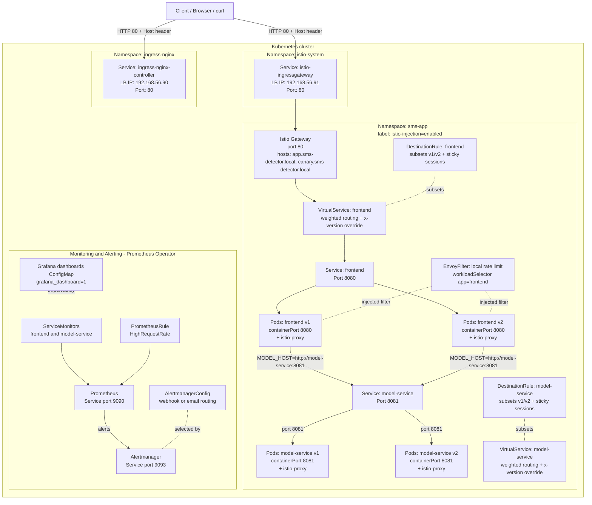
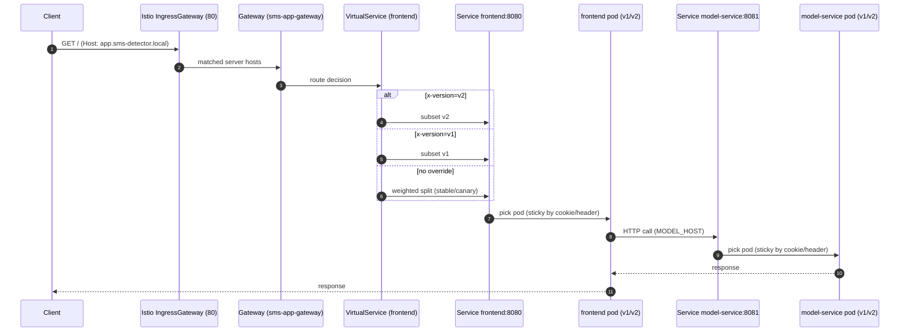
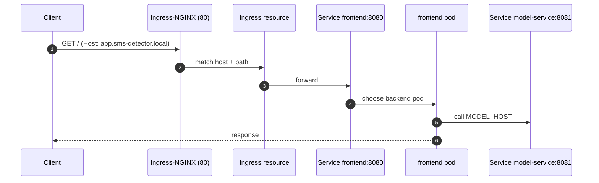
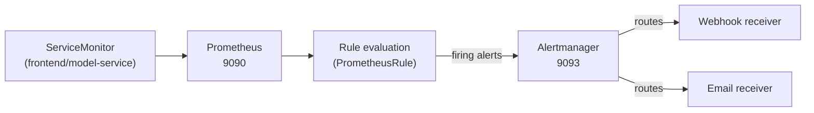

## Deployment documentation

This document describes how the **SMS Spam Detection** system is deployed and routed in Kubernetes, including **Istio traffic management (canary + sticky sessions + rate limiting)** and **monitoring/alerting (Prometheus + Alertmanager)**.

- **Operations repo (this repo)**: Kubernetes/Helm/Ansible assets
- **Frontend repo**: `https://github.com/doda25-team23/app`
- **Model Service repo**: `https://github.com/doda25-team23/model-service`
- **Versioning repo**: `https://github.com/doda25-team23/lib-version`

---

## Architecture overview (what exists in this repo)

There are three “layers” you can deploy from this repository:

- **Local**: `docker-compose.yml` (ports 8080/8081 on localhost)
- **Kubernetes (raw manifests)**: `kubernetes/base/` (Ingress-NGINX -> `frontend`)
- **Kubernetes (Helm)**:
  - **App + Istio**: `helm-chart/` (Namespace + Deployments/Services + Istio Gateway/VS/DR + EnvoyFilter rate limit; optional Ingress)
  - **Monitoring/Alerting**: `helm/app-stack/` (Prometheus Operator CRDs: `Prometheus`, `ServiceMonitor`, `PrometheusRule`, `Alertmanager`, `AlertmanagerConfig`, plus Services)

In practice, the “full” architecture for A4-style deployments is:

- **Application** via `helm-chart/` into namespace **`sms-app`**
- **Monitoring/Alerting** via `helm/app-stack/` into a chosen namespace (often **`monitoring`**)

---

## Cluster prerequisites (lab environment)

From `K8S_SETUP.md`, the Vagrant/Ansible lab provisions:

- **MetalLB** pool: `192.168.56.90-192.168.56.99`
- **Ingress-NGINX** LoadBalancer IP: `192.168.56.90`
- **Istio IngressGateway** LoadBalancer IP: `192.168.56.91`
- **Istio** installed (IstioOperator), and namespaces can be labelled for sidecar injection

---

## Architecture diagram (Kubernetes + Istio + monitoring)

---

## Request flow (client → gateway → services)

### A) Istio Gateway flow (recommended for A4 canary + sticky sessions)

1. **Client** calls `http://app.sms-detector.local/` (or `http://canary.sms-detector.local/`)
2. DNS/hosts entry resolves the hostname to the **Istio IngressGateway** IP (lab default: `192.168.56.91`)
3. `Gateway` (port **80**) accepts hosts:
   - `app.sms-detector.local`
   - `canary.sms-detector.local`
4. `VirtualService` (`sms-app-frontend`) makes the routing decision:
   - If request has **header** `x-version: v1` → route to subset **v1**
   - If request has **header** `x-version: v2` → route to subset **v2**
   - Otherwise → weighted split **v1/v2** (`istio.trafficSplit.stable/canary`)
5. `DestinationRule` enforces **sticky sessions**:
   - default: consistent hash on cookie `sms-app-version` (TTL `3600s`)
   - alternative: consistent hash on header `x-user-id`
6. Frontend pod calls model service using `MODEL_HOST=http://model-service:8081`
   - Model service has its own `VirtualService` + `DestinationRule` so version selection can mirror the frontend behavior.

### B) Ingress-NGINX flow (simple ingress)

If you use `kubernetes/base/` or `helm-chart` with `ingress.enabled=true` (and route to the NGINX LB IP `192.168.56.90`), the flow is:

**Note**: In this repo, Istio canary routing is implemented via the **Istio Gateway/VirtualService/DestinationRule** resources in `helm-chart/templates/`. If you only go through NGINX ingress, you bypass the external Istio gateway routing logic.

---

## Hostnames, ports, routing decisions, and “where is the use case?”

### Hostnames (what you put in DNS or `/etc/hosts`)

- **Stable app**: `app.sms-detector.local` (default in `helm-chart/values.yaml`)
- **Canary app**: `canary.sms-detector.local` (default in `helm-chart/values.yaml`)
- **Monitoring example host**: `app.team23.doda.local` (used by `helm/app-stack/values.yaml` ingress example)

In the lab environment, these hostnames usually map to:

- `app.sms-detector.local` → `192.168.56.91` (Istio Gateway) **or** `192.168.56.90` (Ingress-NGINX)
- `canary.sms-detector.local` → `192.168.56.91` (Istio Gateway)

### Ports (externally and internally)

- **Frontend**:
  - container: **8080**
  - service (Helm `helm-chart/`): **8080**
  - service (monitoring chart `helm/app-stack/`): **80** → targetPort `http` → container **8080**
- **Model service**:
  - container: **8081**
  - service: **8081**
- **Istio IngressGateway**: **80** (HTTP)
- **Ingress-NGINX**: **80** (HTTP)
- **Prometheus service**: **9090**
- **Alertmanager service**: **9093**

### Routing decisions (Istio)

- **Canary split**: `istio.trafficSplit.stable` / `istio.trafficSplit.canary` (must sum to 100)
- **Explicit override**: header `x-version: v1|v2`
- **Sticky sessions** (DestinationRule consistent hashing):
  - cookie-based (`sms-app-version`, TTL `3600s`) **or**
  - header-based (`x-user-id`)
- **Rate limiting**: Envoy `local_ratelimit` filter injected on **frontend inbound** sidecar, configured by:
  - `rateLimit.maxTokens`, `rateLimit.tokensPerFill`, `rateLimit.fillInterval`
  - when exceeded: HTTP **429**, plus response header `x-local-rate-limit: true`

### Where is the “use case” reachable?

- **Web UI use case**: `http://<host>:80/sms` (documented in `README.md` as the UI entrypoint)
- **Model service API docs**: `http://<model-service>:8081/apidocs`
- **Metrics** (for monitoring chart `helm/app-stack/`):
  - frontend (Spring Boot Actuator): `http://frontend:<port>/actuator/prometheus`
  - model-service: `http://model-service:8081/metrics`

---

## Monitoring & alerting flow

This repo’s monitoring stack is expressed as **Prometheus Operator CRDs** in `helm/app-stack/templates/`:

- `ServiceMonitor` discovers `frontend` and `model-service` Services via labels, and scrapes metrics endpoints
- `PrometheusRule` defines alert(s), e.g. `HighRequestRate`
- `Prometheus` evaluates rules and sends alerts to `Alertmanager`
- `AlertmanagerConfig` chooses delivery method:
  - webhook (recommended for testing)
  - email (requires SMTP secret)

Grafana dashboards live in `grafana-dashboards/`. There is also a dashboard ConfigMap *template* at `kubernetes/grafana-dashboard-configmap.yaml` (it contains Helm templating like `.Files.Get`), so it must be rendered as part of a Helm chart (or replaced with literal JSON) before applying directly with `kubectl`.

---

## Deployment inputs (what you typically configure)

### App deployment (`helm-chart/`)

- **Hostnames**: `ingress.hosts.*` and `istio.hosts.*`
- **Traffic split**: `istio.trafficSplit.*`
- **Sticky sessions**: `istio.stickySession.*`
- **Image tags**: `frontend.image.tag`, `modelService.image.tag`
- **Registry auth**: `imagePullSecrets` (e.g., `ghcr-secret`)

### Monitoring/alerting (`helm/app-stack/`)

- **Alert delivery**:
  - webhook URL: `alerting.webhook.url`
  - (optional) email settings + secret
- **Scrape config**: `monitoring.labels` and `monitoring.scrapeInterval`

---

## Useful verification commands

- **App + Istio resources**:
  - `kubectl get pods,svc,ingress -n sms-app`
  - `kubectl get gateway,virtualservice,destinationrule,envoyfilter -n sms-app`

- **Monitoring resources**:
  - `kubectl get prometheus,servicemonitor,prometheusrule -A`
  - `kubectl get alertmanager,alertmanagerconfig -A`
