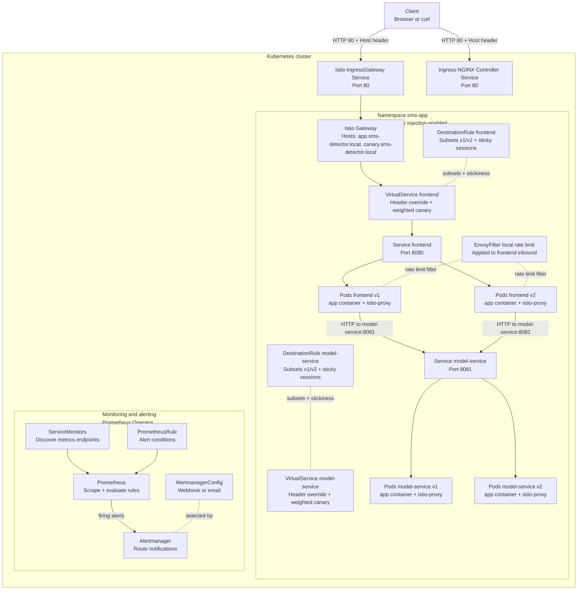
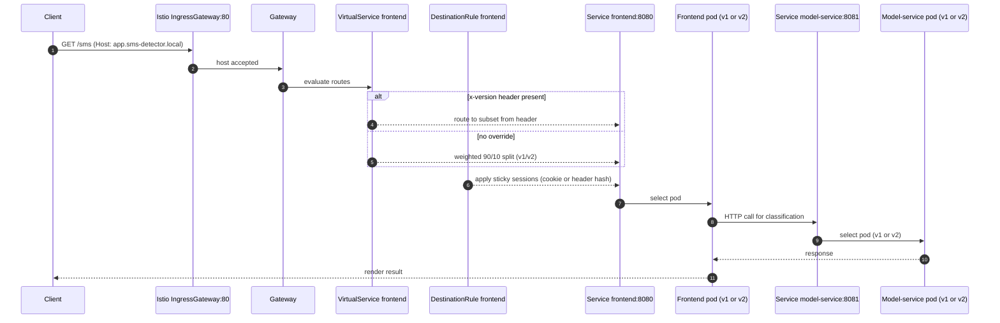
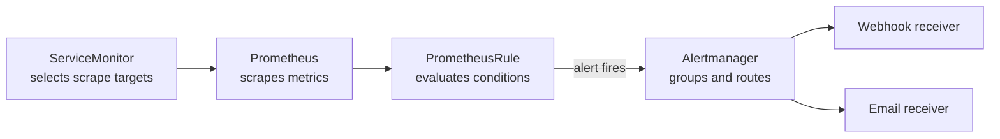

## Deployment documentation (final deployment)

We are Team 23 in the DODA M.Sc. course. This document explains the *conceptual* deployment structure and the request/metrics flows of our final system so a new team member can participate in design discussions.

- **Ops repo (this repo)**: `https://github.com/doda25-team23/operation`
- **Frontend**: `https://github.com/doda25-team23/app`
- **Model service**: `https://github.com/doda25-team23/model-service`
- **Versioning repo**: `https://github.com/doda25-team23/lib-version`

### Scope and non-goals

- **In scope**: Kubernetes resources, Istio traffic management (canary + sticky sessions + rate limiting), monitoring and alerting (Prometheus + Alertmanager), and how they connect.
- **Out of scope**: VM provisioning details and step-by-step installation commands.

---

## System overview

Our system classifies SMS messages as **spam** vs **ham**.

- **Frontend**: web UI + request handling (HTTP)
- **Model service**: ML inference API (HTTP)

At runtime, the frontend calls the model service via an internal Kubernetes Service.

---

## Deployed resources (inventory)

The final deployment consists of these resource groups:

- **Workloads**
  - **Deployments**: `frontend` and `model-service`, each in two versions (**v1** and **v2**) to enable canary experiments.
  - **Pods**: each application pod has an **Istio sidecar** (`istio-proxy`) when the namespace has injection enabled.

- **Service discovery**
  - **Services** (ClusterIP): `frontend` and `model-service` (stable names; traffic routing selects pods by `version` label).

- **External entry**
  - **Istio Gateway**: public entrypoint for the experiment.
  - (Optional) **Kubernetes Ingress** via Ingress-NGINX: a simpler entrypoint when Istio traffic management is not required.

- **Traffic management (experiment logic)**
  - **VirtualService (frontend)**: makes the routing decision (header override vs weighted canary split).
  - **DestinationRule (frontend)**: defines subsets (v1/v2) and sticky-session policy.
  - **VirtualService (model service)** and **DestinationRule (model service)**: mirror the same versioning logic for internal calls.

- **Resilience / “additional use case”**
  - **EnvoyFilter**: local rate limiting on frontend inbound traffic (returns HTTP 429 when exceeded).

- **Observability**
  - **ServiceMonitor** (frontend + model-service): Prometheus target discovery.
  - **Prometheus**: scraping + rule evaluation.
  - **PrometheusRule**: alert definition (e.g., high request rate).
  - **Alertmanager** + **AlertmanagerConfig**: alert routing to webhook/email.
  - **Grafana dashboards**: JSON dashboards provided in the repo (imported via ConfigMap in a Grafana setup).

---

## Architecture diagram (resources and connections)

---

## Access contract: hostnames, ports, paths, headers

This section answers “what do I need to send to reach the application?”

### Hostnames

- **Stable host**: `app.sms-detector.local`
- **Canary host**: `canary.sms-detector.local`

These hostnames are used by the Istio Gateway’s `hosts` list and by the frontend VirtualService’s `hosts` list.

### Ports

- **External**: HTTP **80** (via Istio IngressGateway)
- **Internal**:
  - `frontend` Service: **8080**
  - `model-service` Service: **8081**

### Paths

- **Web UI**: `/sms`
- **Model service API docs**: `/apidocs` (on the model-service)
- **Metrics**:
  - frontend: `/actuator/prometheus`
  - model-service: `/metrics`

### Headers and cookies (experiment controls)

- **Force version** (routing override at VirtualService): `x-version: v1` or `x-version: v2`
- **Sticky sessions** (routing stabilization at DestinationRule):
  - default: cookie `sms-app-version` (hash key)
  - alternative: header `x-user-id` (hash key)

---

## Request flow (typical request path)

### What happens on the way in?

1. A request hits the **Istio IngressGateway** (port 80) with a specific **Host header**.
2. The **Istio Gateway** accepts the request for our hostnames.
3. The **frontend VirtualService** takes the **routing decision**:
   - first: check header override `x-version`
   - else: apply **weighted split** between subsets v1/v2
4. The **frontend DestinationRule** applies **sticky sessions** so repeated requests from the same client tend to stay on the same subset.

### What happens inside the mesh?

5. The selected frontend pod calls the model service using the internal service name (`http://model-service:8081`).
6. The model service has its own VirtualService/DestinationRule so that the **same versioning mechanism** can be applied for internal calls.

---

## Experimental design: where is the 90/10 split and where is the decision taken?

### Where is the 90/10 configured?

- The **weights** live in the **frontend VirtualService** as two routes: subset v1 with weight 90, subset v2 with weight 10.
- We parameterize these values through Helm values (stable/canary percentages), but conceptually the *VirtualService* is the resource that encodes the split.

### Where is the routing decision taken?

- **Primary decision point**: **VirtualService (frontend)**
  - applies header overrides first
  - otherwise applies weighted routing
- **Stabilization**: **DestinationRule (frontend)**
  - consistent-hash policy implements sticky sessions

### Which component implements the additional use case?

- **Rate limiting** is implemented by an **EnvoyFilter** that inserts Envoy’s `local_ratelimit` HTTP filter on **frontend inbound** traffic.
- Behavior: requests exceeding the token bucket are rejected with **HTTP 429**.

---

## Monitoring and alerting flow

We monitor both services via Prometheus and route alerts through Alertmanager.

- **Discovery**: ServiceMonitors select service endpoints to scrape.
- **Scraping**: Prometheus scrapes metrics periodically.
- **Alerting**: PrometheusRules define alert conditions; firing alerts go to Alertmanager.
- **Notification**: AlertmanagerConfig routes alerts to webhook (for testing) or email (for production-like setup).

---

## References inside the repo (details)

We avoid embedding YAML here; use these references when you need implementation details:

- **Application chart + Istio experiment**: `helm-chart/`
- **Monitoring and alerting chart**: `helm/app-stack/`
- **Dashboards**: `grafana-dashboards/`
- **Legacy/raw manifests**: `kubernetes/base/`
