## Extension proposal (next assignment): Reproducible releases for our canary experiment

We are Team 23 in the DODA M.Sc. course. After completing the Kubernetes + Istio + monitoring assignments, we noticed a release-engineering shortcoming that directly threatens the validity of our canary experiment.

---

## The pain point (release-engineering shortcoming)

### What is annoying / error-prone today?

Our deployment and experiment depend on distinguishing **v1 (stable)** from **v2 (canary)**. However, our current practice makes it too easy to deploy **non-reproducible** or **ambiguous** versions:

- We frequently rely on **mutable image tags** (e.g., `latest`) for `frontend` and `model-service`.
- The repository contains **multiple deployment entry points** (raw manifests + two Helm charts). This increases the chance that “what we think we deployed” diverges from “what is actually running”.

### Why is this critical?

For the course, our canary rollout is an *experiment*: we want to attribute outcomes (latency, errors, A/B differences) to a *specific* change between v1 and v2. If both versions accidentally reference the same image (or if `latest` changes over time), we lose:

- **Reproducibility**: we cannot re-run the same experiment later.
- **Traceability**: we cannot confidently answer “what commit was deployed?”
- **Interpretability**: observed differences may be due to untracked changes.

This is a release-engineering problem (versioning and promotion), not “just a Kubernetes configuration” issue.

---

## Proposed refactoring/extension (1–5 days)

### Goal

Make deployments (especially canary experiments) **reproducible by construction** by enforcing **immutable version selection** for both services.

### High-level design

1. **Replace mutable tagging with immutable selection**
   - For each rollout, we deploy:
     - `frontend` v1 = **pinned image identifier**
     - `frontend` v2 = **different pinned image identifier**
     - same for `model-service`
   - “Pinned identifier” can be a semver tag *or* (stronger) an **OCI digest**.

2. **Add a lightweight “release manifest”** for the experiment
   - A single file (e.g., `experiment-release.yaml`) that records:
     - image tags/digests for v1 and v2
     - traffic split (90/10)
     - sticky-session strategy (cookie/header)
     - rate limit parameters
   - This document becomes the reference for “what experiment did we run?”

3. **Introduce a CI validation gate**
   - Validate that the manifest and Helm values:
     - do not use `latest`
     - select distinct versions for v1 and v2
     - keep traffic-split weights valid (sum to 100)

### Visualization: current vs proposed workflow

```mermaid
flowchart TB
  subgraph NOW["Today (risk of ambiguity)"]
    PR1["Change merged"] --> DEP1["Deploy with Helm values"]
    DEP1 --> L1["Images may use latest"]
    L1 --> EXP1["Run 90/10 canary"]
    EXP1 --> Q1["Hard to reproduce later"]
  end

  subgraph NEW["After extension (reproducible)"]
    PR2["Change merged"] --> REL["Create release manifest<br/>with pinned image ids"]
    REL --> CI["CI validation gate"]
    CI --> DEP2["Deploy from manifest"]
    DEP2 --> EXP2["Run 90/10 canary"]
    EXP2 --> Q2["Re-run experiment anytime"]
  end
```

---

## Concrete implementation tasks (clear 1–5 day plan)

### A) Add immutability and experiment manifest

- **Task A1**: Create `docs/experiment-release.template.md` (human-readable) and `experiment-release.yaml` (machine-readable) in this repo.
- **Task A2**: Update our Helm values convention so that:
  - v1 and v2 image identifiers are explicit
  - v1 and v2 cannot be identical by accident

### B) Add CI enforcement (“release validation gate”)

- **Task B1**: Add a script (`scripts/validate-release.sh`) that checks:
  - no `:latest` tags in the experiment manifest
  - v1 != v2 for both services
  - traffic weights are valid (sum to 100)
- **Task B2**: Run `helm lint` + `helm template` to ensure charts render.
- **Task B3**: Optional but valuable: schema checks (e.g., `kubeconform`) on rendered manifests.
- **Task B4**: Add a GitHub Actions workflow that runs these validations for every PR.

### C) (Optional) Improve promotion safety

- **Task C1**: Add a documented manual promotion step: update the manifest so v2 becomes the new v1, then redeploy.
- **Task C2**: (Stretch) Add a canary “scorecard” checklist based on Prometheus metrics (error rate, latency) before promoting.

---

## Expected outcome

- **Reproducible experiments**: we can re-run the same 90/10 canary with identical versions.
- **Reduced operator error**: CI blocks accidental `latest` usage and v1/v2 mismatches.
- **Clearer design discussions**: we can point to the manifest as “the experiment configuration”.

---

## How to measure whether it worked (experiment design)

We can measure the impact with a before/after study across several PRs:

- **Primary metric: reproducibility time**
  - Definition: time to answer “what exact versions were deployed in the canary experiment?”
  - Expectation: after the change, it becomes near-instant (read one manifest).

- **Secondary metric: configuration-induced deployment failures**
  - Definition: number of failed deploy attempts due to wrong tags/values/misrendered manifests.
  - Expectation: decreases after introducing validation.

- **Delivery-performance tie-in (DORA / Four Keys)**
  - Focus: lower **change failure rate** and reduced **time to restore** when rollbacks are needed.

---

## Assumptions and downsides

- **Assumption**: we can build/publish images with immutable identifiers (tag or digest) in our CI.
- **Downside**: pinned digests are less readable than tags; we mitigate by storing both tag and digest in the manifest.
- **Downside**: validation adds a small CI time cost, but it saves much more time than it consumes when errors occur.

---

## Sources (quality references)

- **Kubernetes docs** on image tags and pull behavior (why `latest` is risky): `https://kubernetes.io/docs/concepts/containers/images/`
- **Google Kubernetes Engine guide** on using image digests (immutability): `https://cloud.google.com/kubernetes-engine/docs/tutorials/using-container-image-digests-in-kubernetes-manifests`
- **DORA report** (delivery performance metrics): `https://dora.dev/research/2022/dora-report/2022-dora-accelerate-state-of-devops-report.pdf`
- **Google SRE workbook** discussion of canarying releases (monitoring and safe rollout): `https://sre.google/workbook/canarying-releases/`
- **Helm documentation** for chart validation (`helm lint`): `https://helm.sh/docs/helm/helm_lint/`
