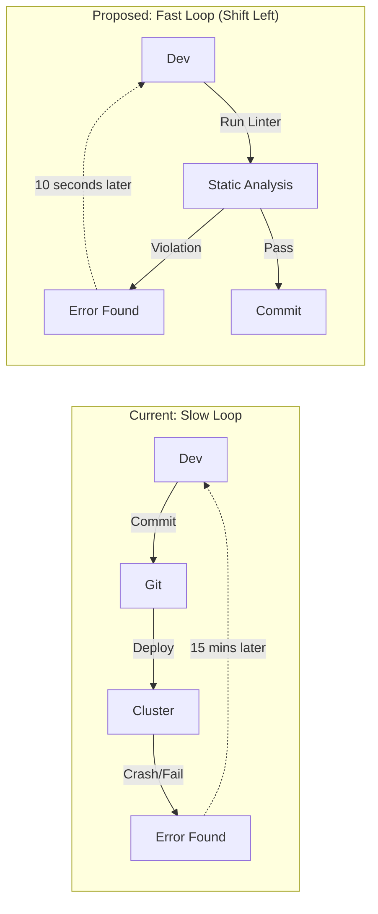

## Extension Proposal: "Shift-Left" Configuration Validation

We are Team 23 in the DODA M.Sc. course. Throughout the assignment, we noticed that while our application code is linted and tested, our **infrastructure code (YAML)** is not. This leads to a slow and frustrating feedback loop during deployments.

---

## 1. The Pain Point: Slow Feedback on Configuration Errors

### What is the problem?
Currently, if we make a mistake in our Kubernetes configuration (e.g., forgetting a `livenessProbe`, missing a required `label`, or defining invalid resource limits), we only discover it **at deployment time**.
1.  **Late Detection**: We have to commit, push, wait for the pipeline to run, and watch `helm upgrade` fail (or worse, the pod crashes after deployment).
2.  **Wasted Time**: A simple typo can cost 10-15 minutes of "debugging via pipeline."
3.  **Inconsistent Quality**: Without automated checks, it's easy to merge a PR that "works" but violates best practices (e.g., running as root, no CPU limits), creating technical debt.

### Why is this a shortcoming?
In modern Release Engineering, we aim to "Shift Left"—finding errors as early as possible in the development cycle. Our current process catches config errors at the very end (Deployment), which is the most expensive place to fix them.

---

## 2. Proposed Extension: Automated Static Analysis for Manifests

We propose to integrate a **Static Analysis** tool (specifically **KubeLinter** or **Kubeval**) into our local workflow and CI pipeline. This treats our infrastructure configuration with the same rigor as our application source code.

### High-Level Design
We will introduce a validation step that runs **before** any attempt to deploy.

1.  **The Validator**: A CLI tool that parses our Helm charts and rendered manifests.
2.  **The Ruleset**: A configuration file defining what "Good" looks like:
    *   *Reliability*: All deployments must have liveness/readiness probes.
    *   *Efficiency*: All containers must have CPU/Memory requests and limits.
    *   *Security*: No container should run as root (securityContext).
3.  **The Gate**: If the linter finds violations, the commit is rejected or the build fails immediately.

### Visualization: Feedback Loop

---

## 3. Concrete Implementation Tasks (1-3 Day Plan)

### Task A: Tool Selection & Setup (Day 1)
*   Install **KubeLinter** (open source by StackRox) locally.
*   Create a `.kube-linter.yaml` config file in the repo root.
*   Define the initial policy: disable noisy checks, enable critical ones (Limits, Probes).

### Task B: Integration Script (Day 1)
*   Create `scripts/lint-manifests.sh`.
*   This script should:
    1.  Run `helm template` to render the charts into raw YAML (since linters often work on raw YAML).
    2.  Pipe the output to `kube-linter check`.
    3.  Exit with code 1 if issues are found.

### Task C: CI/Workflow Integration (Day 2)
*   Add a `lint` target to our `Makefile`.
*   (Optional) Add a pre-commit hook or GitHub Actions workflow to run this automatically on every PR.

---

## 4. Expected Outcome

*   **Instant Feedback**: Developers know immediately if their YAML is invalid.
*   **Higher Quality**: We guarantee that *every* pod in production has resource limits and health checks.
*   **Reduced Frustration**: No more "waiting for CI" just to find a syntax error.

---

## 5. Evaluation: Measuring Improvement

We can measure the efficiency of our development process.

**Hypothesis**: Static analysis significantly reduces the "Time to Detect" configuration errors.

**Experiment Protocol**:
1.  **Scenario**: Introduce a common error: remove the `readinessProbe` from `frontend-deployment.yaml`.
2.  **Baseline (Current)**:
    *   Time the process: Commit -> Push -> Deploy -> Watch Pods -> "CrashLoopBackOff" or "Service Unavailable".
    *   *Estimate*: ~5-10 minutes.
3.  **Treatment (Proposed)**:
    *   Time the process: Run `make lint`.
    *   *Estimate*: < 10 seconds.

**Metric**: **Feedback Latency** (Time from error introduction to error discovery).

---

## 6. Sources and Inspiration

*   **KubeLinter Documentation**:
    *   *Source*: The tool we plan to use.
    *   [https://docs.kubelinter.io/](https://docs.kubelinter.io/)
*   **Google Cloud: Shift Left Security**:
    *   *Concept*: Explains the philosophy of moving checks earlier in the pipeline.
    *   [https://docs.cloud.google.com/architecture/framework/security/implement-shift-left-security](https://docs.cloud.google.com/architecture/framework/security/implement-shift-left-security)
